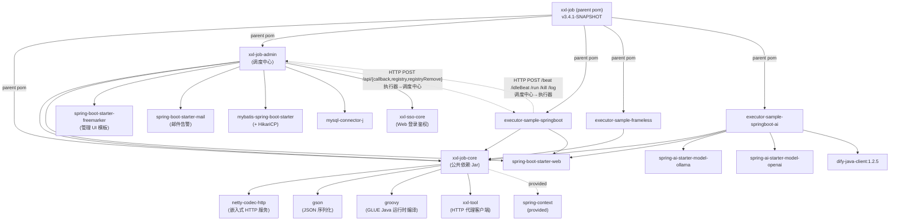

# XXL-JOB Architecture

> 基于代码实测（v3.4.1-SNAPSHOT）整理，资料与代码冲突处以代码为准。

---

## 项目定位

轻量级分布式任务调度平台：调度中心统一管理任务，执行器集群分布式执行，两者通过 HTTP 双向通信解耦。

---

## 核心概念

| 概念 | 说明 |
|------|------|
| **调度中心（Admin）** | 唯一的调度决策节点。负责触发时机、路由寻址、日志记录、告警，自身不执行业务逻辑 |
| **执行器（Executor）** | 业务方部署的任务执行节点，内嵌 Netty HTTP 服务接收调度指令，支持集群部署 |
| **AppName** | 执行器集群的唯一标识。调度中心通过 AppName 找到一组在线执行器地址，再按路由策略选其中一个 |
| **JobHandler** | 具体任务逻辑的实现单元。Bean 模式下用 `@XxlJob("name")` 注解注册，每个 jobId 对应一个专属 `JobThread` |
| **GLUE 模式** | 任务代码托管在调度中心数据库，下发时随 `TriggerRequest` 传给执行器，执行器运行时编译执行，无需重新部署 |
| **路由策略** | 决定将任务分发到执行器集群中哪个节点。共 10 种：FIRST / LAST / ROUND / RANDOM / CONSISTENT_HASH / LFU / LRU / FAILOVER / BUSYOVER / SHARDING_BROADCAST |
| **分片广播** | 路由策略之一。调度中心将同一任务广播给所有在线执行器，每个节点收到不同的 `broadcastIndex/broadcastTotal`，实现数据并行分片 |
| **时间轮** | 调度中心内部触发机制。`scheduleThread` 每秒扫描 DB 预读 5s 内任务，写入 `Map<秒数, List<jobId>>`；`ringThread` 每秒从中取出并触发，前后多取 2 格防遗漏 |

---

## 模块清单

| 模块 | 打包方式 | 职责 |
|------|---------|------|
| `xxl-job-core` | Jar（发布到 Maven Central） | 调度中心与执行器共用的协议模型、接口定义、Netty 嵌入服务、注册线程、回调线程 |
| `xxl-job-admin` | Spring Boot 独立应用 | 调度中心：时间轮调度、路由选址、触发线程池、日志、告警、Web 管理 UI、对外 OpenAPI |
| `xxl-job-executor-sample-springboot` | Spring Boot 可执行 Jar | Spring Boot 执行器接入示例，含 `XxlJobSpringExecutor` 配置和 `@XxlJob` 示例 Handler |
| `xxl-job-executor-sample-frameless` | 普通 Jar | 无框架执行器接入示例，手动 new `XxlJobExecutor`，最小依赖 |
| `xxl-job-executor-sample-springboot-ai` | Spring Boot 可执行 Jar | AI 执行器示例，在 Spring Boot 执行器基础上集成 spring-ai（Ollama/OpenAI）和 Dify |

---

## 模块依赖

### 依赖图



### 关键依赖说明

| 依赖边 | 为什么 |
|--------|--------|
| `admin → core` | 复用协议模型（`TriggerRequest`、`ExecutorBiz`/`AdminBiz` 接口）；用 `xxl-tool HttpTool.proxy(ExecutorBiz.class)` 生成执行器 HTTP 客户端。见 [XxlJobAdminBootstrap.java:153](xxl-job-admin/src/main/java/com/xxl/job/admin/scheduler/config/XxlJobAdminBootstrap.java#L153) |
| `core → netty` | `EmbedServer` 用 Netty 在执行器侧启动内嵌 HTTP 服务，接收 `/run /kill /beat` 等调用。见 [EmbedServer.java:65](xxl-job-core/src/main/java/com/xxl/job/core/server/EmbedServer.java#L65) |
| `core → groovy` | GLUE Java 模式下，`GlueFactory` 运行时将 Admin 下发的 Groovy 源码编译为 `IJobHandler`。见 [ExecutorBizImpl.java:95](xxl-job-core/src/main/java/com/xxl/job/core/openapi/impl/ExecutorBizImpl.java#L95) |
| `core → spring-context (provided)` | `XxlJobSpringExecutor` 扫描 Spring 容器中的 `@XxlJob` Bean；frameless 场景下此依赖不存在，core 不强制捆绑 |
| `admin → mybatis + mysql` | 6 个 Mapper 操作 MySQL，包含分布式调度锁（`SELECT ... FOR UPDATE`）和时间轮扫描。见 [XxlJobLockMapper.xml:6](xxl-job-admin/src/main/resources/mapper/XxlJobLockMapper.xml#L6) |
| `admin → xxl-sso-core` | Web 页面走 SSO 登录；OpenAPI 端点用 `@XxlSso(login=false)` 跳过，转为 accessToken 验证。见 [OpenApiController.java:33](xxl-job-admin/src/main/java/com/xxl/job/admin/scheduler/openapi/OpenApiController.java#L33) |

---

## 核心数据流

> 以 **Cron 定时触发** 为主链路；手动/API 触发直接从 STEP 3 进入。

### 主链路

```
STEP 1  scheduleThread（Admin）
        每秒扫描 DB，SELECT FOR UPDATE 拿锁
        → scheduleJobQuery(nowTime + 5s) → List<XxlJobInfo>
        → 按触发秒写入 ringData: Map<Integer秒, List<Integer jobId>>
        文件：JobScheduleHelper.java:77-148

STEP 2  ringThread（Admin）
        每秒取 ringData[now秒 ± 2格]（防跨格遗漏）
        → JobTriggerPoolHelper.trigger(jobId, CRON, ...)
        文件：JobScheduleHelper.java:196-253

STEP 3  TriggerPool 线程池（Admin，异步）          ← 异步节点①
        慢任务降级：同一 jobId 近1分钟超时>10次 → 路由到 slowPool
        → JobTrigger.trigger()
        文件：JobTriggerPoolHelper.java:108-112

STEP 4  JobTrigger.processTrigger()（Admin）
        a. INSERT xxl_job_log（logId，handleCode=0，状态：进行中）
        b. 组装 TriggerRequest（jobId/logId/handler/params/glueSource/broadcastIndex/Total/timeout）
        c. ExecutorRouteStrategyEnum.route() 从注册列表选目标地址
           SHARDING_BROADCAST → 循环调用 processTrigger N 次（N=在线执行器数）
        d. HTTP POST {address}/run（TriggerRequest JSON）
        e. UPDATE xxl_job_log（triggerCode/executorAddress/triggerMsg）
        文件：JobTrigger.java:134-279

STEP 5  EmbedServer（Executor，Netty bizThreadPool 异步处理）
        接收 /run → ExecutorBizImpl.run(TriggerRequest)
        a. 按 GlueType 选 Handler：
           BEAN      → XxlJobExecutor.loadJobHandler(handlerName)
           GLUE_GROOVY → GlueFactory 运行时 Groovy 编译
           脚本类型   → new ScriptJobHandler(source, glueType)
        b. 阻塞策略：
           SERIAL_EXECUTION → 直接入队
           DISCARD_LATER    → 队列非空则返回失败
           COVER_EARLY      → 杀旧线程重建
        c. jobThread.pushTriggerQueue(triggerRequest)
        d. 立即返回 200（任务执行是异步的）    ← 异步节点②
        文件：ExecutorBizImpl.java:49-150

STEP 6  JobThread（Executor，每 jobId 一个专属线程）
        a. poll triggerQueue（3s 超时，空闲 30 次后自我销毁）
        b. 初始化 XxlJobContext（ThreadLocal，含 broadcastIndex/Total）
        c. 写本地日志文件 logPath/yyyy-MM-dd/{logId}.log
        d. handler.execute()
           若 executorTimeout > 0：FutureTask.get(timeout) 限时，超时 interrupt
        e. TriggerCallbackThread.pushCallBack(CallbackRequest)
        文件：JobThread.java:89-247

STEP 7  TriggerCallbackThread（Executor，异步）    ← 异步节点③
        批量取 callBackQueue（drainTo），HTTP POST {adminAddr}/api/callback
        → Admin OpenApiController → AdminBizImpl.callback()
        → JobCompleteHelper.callbackThreadPool（2-20线程）异步处理
        文件：TriggerCallbackThread.java:67-116

STEP 8  JobCompleter（Admin）
        a. processChildJob()：若 handleCode=SUCCESS 且有 childJobId → 重回 STEP 3
        b. UPDATE xxl_job_log（handleCode/handleMsg/handleTime）
        最终落点：xxl_job_log 表，handleCode=200（成功）/ 500（失败）
        文件：JobCompleter.java:39-121
```

### 关键异步 / 失败节点

| 节点 | 机制 | 文件 |
|------|------|------|
| ① scheduleThread → TriggerPool | 经 ringData Map 过渡，两个线程完全解耦 | [JobScheduleHelper.java:130](xxl-job-admin/src/main/java/com/xxl/job/admin/scheduler/thread/JobScheduleHelper.java#L130) |
| ② HTTP /run 返回后异步执行 | TriggerRequest 入 `LinkedBlockingQueue`，立即返回 200 | [ExecutorBizImpl.java:149](xxl-job-core/src/main/java/com/xxl/job/core/openapi/impl/ExecutorBizImpl.java#L149) |
| ③ 回调失败 → 文件重试 | 写 `xxl-job-callback-{md5}.log`，`TriggerRetryCallbackThread` 每 30s 重试 | [TriggerCallbackThread.java:196](xxl-job-core/src/main/java/com/xxl/job/core/thread/TriggerCallbackThread.java#L196) |
| ④ 执行超时 | `FutureTask.get(timeout)` 抛 `TimeoutException` → `handleTimeout`，仍走回调流程 | [JobThread.java:134](xxl-job-core/src/main/java/com/xxl/job/core/thread/JobThread.java#L134) |
| ⑤ 失败重试 | `JobFailAlarmMonitorHelper` 每 10s 扫描 handleCode=500 的日志，`retryCount > 0` 则重回 STEP 3，同时触发邮件告警 | [JobFailAlarmMonitorHelper.java:54](xxl-job-admin/src/main/java/com/xxl/job/admin/scheduler/thread/JobFailAlarmMonitorHelper.java#L54) |
| ⑥ 执行器失联（结果丢失） | `JobCompleteHelper.monitorThread` 每 60s 扫描，执行中超 10 分钟且执行器离线 → 主动标记 FAIL | [JobCompleteHelper.java:77](xxl-job-admin/src/main/java/com/xxl/job/admin/scheduler/thread/JobCompleteHelper.java#L77) |

---

## 代码之外的未决问题

以下事项代码层面无法确认，需人工判断：

| # | 问题 | 背景 |
|---|------|------|
| 1 | **GLUE 版本历史上限是否为 30 版** | `XxlJobLogGlueMapper` 存在版本记录，但清理逻辑的具体版本上限未在代码中直接确认 |
| 2 | **AI 示例是否已接入生产** | `xxl-job-executor-sample-springboot-ai` 仅为 sample 模块，是否有业务方实际使用代码层面无法判断 |
| 3 | **700+ 注册企业数量** | 来自官方 README 自报名单，无法通过代码核实 |
| 4 | **fastPool / slowPool 的线程数上限配置** | 由 `xxl.job.triggerpool.fast.max` / `xxl.job.triggerpool.slow.max` 配置项决定，默认值 200/100，生产建议值需结合实际 QPS 评估 |
| 5 | **分布式调度锁的 DB 性能瓶颈** | `SELECT ... FOR UPDATE` 在 Admin 集群规模较大时可能成为热点，是否需要升级为其他锁机制由架构团队决策 |

---

## Seam 与债务地图

### Seam 清单

#### 接口型 Seam（可替换实现）

| Seam | 位置 | 能做什么 | 粒度 |
|------|------|------|------|
| `ExecutorBiz` | [ExecutorBiz.java](xxl-job-core/src/main/java/com/xxl/job/core/openapi/ExecutorBiz.java) | 替换调度中心→执行器的传输协议（HTTP → gRPC / MQ） | 模块级 |
| `AdminBiz` | [AdminBiz.java](xxl-job-core/src/main/java/com/xxl/job/core/openapi/AdminBiz.java) | 替换执行器→调度中心的回调传输；当前 7 个方法注释占位，可按需实现 | 模块级 |
| `IJobHandler` | [IJobHandler.java](xxl-job-core/src/main/java/com/xxl/job/core/handler/IJobHandler.java) | 新增 Handler 类型（自定义执行模式） | 方法级 |
| `JobAlarm` | [JobAlarm.java](xxl-job-admin/src/main/java/com/xxl/job/admin/scheduler/alarm/JobAlarm.java) | 新增告警渠道（Lark/Webhook）；`JobAlarmer` 用 `List<JobAlarm>` 注入，加 Bean 即生效 | 类级 |

#### 策略型 Seam（可扩展枚举）

| Seam | 位置 | 能做什么 | 粒度 |
|------|------|---------|------|
| `ExecutorRouteStrategyEnum`（10 种路由） | [ExecutorRouteStrategyEnum.java](xxl-job-admin/src/main/java/com/xxl/job/admin/scheduler/route/ExecutorRouteStrategyEnum.java) | 新增路由策略（继承 `ExecutorRouter`，加枚举值） | 类级 |
| `ExecutorRouter` 各实现 | [route/strategy/](xxl-job-admin/src/main/java/com/xxl/job/admin/scheduler/route/strategy/) | 修改单个路由算法，互不影响 | 方法级 |
| `MisfireHandler`（FIRE_ONCE_NOW / DO_NOTHING） | [JobScheduleHelper.java:112](xxl-job-admin/src/main/java/com/xxl/job/admin/scheduler/thread/JobScheduleHelper.java#L112) | 新增 misfire 处理策略 | 方法级 |
| `ScheduleTypeEnum`（CRON / FIX_RATE / FIX_DELAY） | [ScheduleTypeEnum.java](xxl-job-admin/src/main/java/com/xxl/job/admin/scheduler/type/ScheduleTypeEnum.java) | FIX_DELAY 已有骨架但注释禁用，完善即可启用 | 枚举值级 |

#### 配置型 Seam（运行时可调）

| Seam | 配置项 | 默认值 | 说明 |
|------|--------|--------|------|
| 触发线程池上限 | `xxl.job.triggerpool.fast.max` / `.slow.max` | 300 / 200 | 硬最小值 200/100；按公式 `(fast+slow)×10 = preReadCount/5s` 推算上限 |
| 调度批次大小 | `xxl.job.schedule.batchsize` | 100 | 调小可缩短 `FOR UPDATE` 持锁时长 |
| 访问令牌 | `xxl.job.admin.accessToken` | — | OpenAPI 鉴权唯一配置点，生产必填 |

#### 工厂型 Seam

| Seam | 位置 | 能做什么 |
|------|------|---------|
| `GlueFactory` | [GlueFactory.java](xxl-job-core/src/main/java/com/xxl/job/core/glue/GlueFactory.java) | 替换 GLUE 运行时（Groovy → 其他 JVM 脚本引擎）；`refreshInstance(type)` 切换 Spring/非 Spring 版本 |
| `XxlJobSpringExecutor` Bean 配置 | [XxlJobConfig.java](xxl-job-executor-samples/xxl-job-executor-sample-springboot/src/main/java/com/xxl/job/executor/config/XxlJobConfig.java) | 执行器所有参数的注入入口，IP/Port/AppName 等均在此集中 |

#### 事件型 Seam

| Seam | 位置 | 能做什么 |
|------|------|---------|
| `JobCompleter.processChildJob()` | [JobCompleter.java:39](xxl-job-admin/src/main/java/com/xxl/job/admin/scheduler/complete/JobCompleter.java#L39) | 任务完成后的钩子；子任务触发逻辑集中于此，可扩展为 DAG |
| `TriggerCallbackThread` 回调队列 | [TriggerCallbackThread.java:67](xxl-job-core/src/main/java/com/xxl/job/core/thread/TriggerCallbackThread.java#L67) | 执行结果上报的唯一出口；可在此插入审计/指标上报逻辑 |

---

### 债务地图

#### 红（需要主动处理）

| # | 问题 | 位置 | 严重原因 |
|---|------|------|---------|
| R-1 | **触发线程池拒绝策略静默丢任务** | [JobTriggerPoolHelper.java:108](xxl-job-admin/src/main/java/com/xxl/job/admin/scheduler/thread/JobTriggerPoolHelper.java#L108) | rejection handler 只打 error 日志，任务不执行也不重试；回调线程池是 `r.run()`，两者不一致，高危 |
| R-2 | **JobScheduleHelper 22 次修改，bug 高发区** | [JobScheduleHelper.java](xxl-job-admin/src/main/java/com/xxl/job/admin/scheduler/thread/JobScheduleHelper.java) | 2 年内修改频率最高；WARN 日志"trigger too fast, repeat trigger suppressed"（line 222）说明边界条件至今仍在修复 |
| R-3 | **FIX_DELAY 半成品，注释禁用** | [ScheduleTypeEnum.java:28](xxl-job-admin/src/main/java/com/xxl/job/admin/scheduler/type/ScheduleTypeEnum.java#L28) [JobCompleter.java:50](xxl-job-admin/src/main/java/com/xxl/job/admin/scheduler/complete/JobCompleter.java#L50) | 枚举值注释掉但 Completer 里有 "on the way" 占位逻辑，功能残缺却有代码路径，行为不可预期 |
| R-4 | **AdminBiz 7 个方法长期注释占位** | [AdminBiz.java](xxl-job-core/src/main/java/com/xxl/job/core/openapi/AdminBiz.java) | `jobAdd/jobUpdate/jobDelete` 等核心 OpenAPI 方法未实现，调用方依赖接口定义却无实现，误导集成方 |
| R-5 | **CronExpression.getFinalFireTime() 永远返回 null** | [CronExpression.java:366](xxl-job-admin/src/main/java/com/xxl/job/admin/scheduler/cron/CronExpression.java#L366) | FUTURE_TODO 注释，方法签名存在但无实现；依赖此方法判断任务终止时间的场景会静默失效 |

#### 黄（需要知悉，按需处理）

| # | 问题 | 位置 | 说明 |
|---|------|------|------|
| Y-1 | **`deprecated/` 和 `old/` 目录 20 个死代码文件** | [xxl-job-core/src/main/java/com/xxl/job/core/deprecated/](xxl-job-core/src/main/java/com/xxl/job/core/deprecated/) | 无活跃引用，仅占代码导航干扰；清理前需确认无外部 jar 依赖 |
| Y-2 | **EmbedServer 从 xxl-rpc 复制维护** | [EmbedServer.java](xxl-job-core/src/main/java/com/xxl/job/core/server/EmbedServer.java) | 非独立演进，上游 xxl-rpc 修复不会自动同步；Netty 升级需手动同步 |
| Y-3 | **`JobThread` 空闲 30 次自毁有竞态注释** | [JobThread.java:183](xxl-job-core/src/main/java/com/xxl/job/core/thread/JobThread.java#L183) | 代码已有 guard，但注释说明存在理论竞态窗口，高并发场景需关注 |
| Y-4 | **GLUE 版本上限未在已读代码确认** | `XxlJobLogGlueMapper.xml` | 文档称 30 版，需读 mapper XML 或 Service 层的 `DELETE ... LIMIT ?` 确认实际值 |
| Y-5 | **fastPool/slowPool 默认值与文档不符** | [application.properties](xxl-job-admin/src/main/resources/application.properties) | ARCHITECTURE.md 原文写"默认 200/100"，实际配置是 300/200；代码硬最小值才是 200/100 |
| Y-6 | **`scheduleBatchUpdate` 替换单行更新（近期改动）** | [JobScheduleHelper.java:141](xxl-job-admin/src/main/java/com/xxl/job/admin/scheduler/thread/JobScheduleHelper.java#L141) | 旧代码注释保留，新旧并存，回归风险窗口尚未关闭 |

#### 绿（正常演进，定位即可）

| # | 位置 | 说明 |
|---|------|------|
| G-1 | [JobFailAlarmMonitorHelper.java:54](xxl-job-admin/src/main/java/com/xxl/job/admin/scheduler/thread/JobFailAlarmMonitorHelper.java#L54) | 失败重试 + 告警，10s 轮询，逻辑稳定 |
| G-2 | [JobCompleteHelper.java:77](xxl-job-admin/src/main/java/com/xxl/job/admin/scheduler/thread/JobCompleteHelper.java#L77) | 执行器失联兜底，60s 扫描，正常演进 |
| G-3 | [ExecutorRegistryThread.java](xxl-job-core/src/main/java/com/xxl/job/core/thread/ExecutorRegistryThread.java) | 执行器注册/续约，30s 心跳，逻辑单一 |
| G-4 | [xxl-job-executor-sample-springboot-ai/](xxl-job-executor-samples/xxl-job-executor-sample-springboot-ai/) | AI 示例模块，sample 性质，不影响主链路 |
| G-5 | [XxlJobAdminBootstrap.java](xxl-job-admin/src/main/java/com/xxl/job/admin/scheduler/config/XxlJobAdminBootstrap.java) | 6 个 helper 线程按序启停，生命周期管理清晰 |

---

### 禁区清单

#### 有明显警告的历史代码（改前必读注释）

| 禁区 | 位置 | 警告内容 |
|------|------|---------|
| `CronExpression` 整个文件 | [CronExpression.java](xxl-job-admin/src/main/java/com/xxl/job/admin/scheduler/cron/CronExpression.java) | 借自 Quartz v2.5.2，含 2 处 FUTURE_TODO（line 366、1606），`getFinalFireTime()` 未实现；修改需同步理解 Quartz 原版语义 |
| `JobThread` 空闲销毁逻辑 | [JobThread.java:170-190](xxl-job-core/src/main/java/com/xxl/job/core/thread/JobThread.java#L170) | 竞态注释已标注，修改需保持 `toStop` flag 的 happens-before 语义 |
| `EmbedServer` Netty 初始化 | [EmbedServer.java:65](xxl-job-core/src/main/java/com/xxl/job/core/server/EmbedServer.java#L65) | 复制自 xxl-rpc，升级 Netty 版本时需全量回归，不可只改依赖版本号 |

#### 涉及核心数据流（改动影响全链路）

| 禁区 | 位置 | 为什么不能轻动 |
|------|------|--------------|
| `scheduleThread` + `ringData` | [JobScheduleHelper.java:77-148](xxl-job-admin/src/main/java/com/xxl/job/admin/scheduler/thread/JobScheduleHelper.java#L77) | 调度入口，`SELECT FOR UPDATE` + 时间轮写入，修改直接影响所有任务触发时机 |
| `JobTrigger.processTrigger()` | [JobTrigger.java:134](xxl-job-admin/src/main/java/com/xxl/job/admin/scheduler/trigger/JobTrigger.java#L134) | 路由寻址 + HTTP 触发 + 日志落库三合一，修改任一步骤影响触发可靠性 |
| `TriggerCallbackThread` 回调+重试 | [TriggerCallbackThread.java:67-196](xxl-job-core/src/main/java/com/xxl/job/core/thread/TriggerCallbackThread.java#L67) | 唯一的结果回报通道；文件重试机制（`xxl-job-callback-{md5}.log`）与主流程耦合，改主流程须同步改重试 |
| `xxl_job_lock` 调度锁事务边界 | [JobScheduleHelper.java:75](xxl-job-admin/src/main/java/com/xxl/job/admin/scheduler/thread/JobScheduleHelper.java#L75) + [XxlJobLockMapper.xml:6](xxl-job-admin/src/main/resources/mapper/XxlJobLockMapper.xml#L6) | 分布式调度的唯一仲裁点，改锁范围或锁机制需全集群灰度，无法单节点验证 |

#### 未决问题标注"问人"的（改前需人工确认）

| 禁区 | 需要确认的对象 | 原因 |
|------|--------------|------|
| AI 示例模块是否有生产依赖方 | 项目维护者 / 社区 | 若有业务方依赖 sample 的包结构，重命名或重构 sample 会破坏其构建 |
| 分布式调度锁替换为 Redis 方案 | 架构团队 | 影响所有 Admin 节点行为，需全团队评审后决策，个人不可单独推进 |
| GLUE 版本上限值 | 读 `XxlJobLogGlueMapper.xml` 确认后再决策 | 若上限非 30，依赖此假设的容量规划需重算 |
